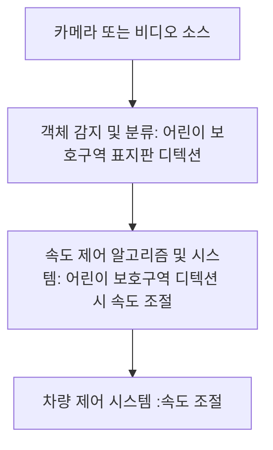
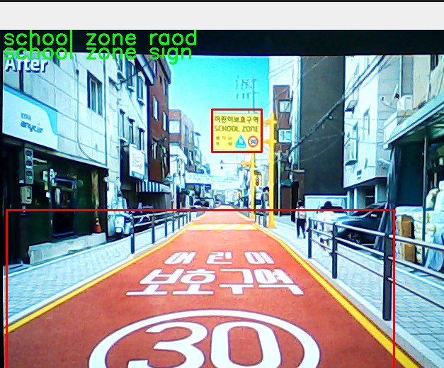

# 어린이 보호해조

## 환경설정

* [Ubuntu](./doc/environment/ubuntu.md)
* [OpenVINO](./doc/environment/openvino.md)
* [YOLOv8](https://github.com/ultralytics/ultralytics/blob/main/README.md)

### 조이름 : 어린이 보호해조
Members
| Name           | Role |
|-------------------------------|---------------------------|
| 이인혁 | Project lead, 프로젝트를 총괄하고 망하면 책임진다. |
| 장민영 | Project manager, 마일스톤을 생성하고 프로젝트 이슈 진행상황을 관리한다. |
| 한민규 | UI design, 사용자 인터페이스를 정의하고 구현한다. |
| 이병찬 | AI modeling, 원하는 결과가 나오도록 AI model을 선택, data 수집, training을 수행한다. |
| 신혜원 | Architect, 프로젝트의 component를 구성하고 상위 디자인을 책임진다. |
| Project Github | https://github.com/LIH00/protectPJ/blob/main/README.md |

# Project: 보호구역에 따른 스마트 크루즈 컨트롤

* 이미지 인식을 통해 보호구역에 진입시 자동으로 속도 조절

  
  
## High Level Design

flow chart:


-------------------

1. 카메라 또는 비디오 소스:

 
     -차량에 장착된 카메라나 비디오 소스로부터 영상을 획득합니다.

   
2. 객체 감지 및 분류:

 
     -객체 감지 및 분류 모델(YOLO 등)을 사용하여 어린이 보호구역 표지판이나 구역 내 도로를 디텍트합니다.

   
3. 속도 제어 알고리즘 및 시스템:


     -어린이 보호구역 표지판이 감지되면, 속도를 제어하기 위한 알고리즘과 시스템이 활성화됩니다.
   
     -알고리즘은 어린이 보호구역 표지판의 감지 여부에 따라 속도를 조절하거나 유지하는 방식을 결정합니다.

  
4. 차량 제어 시스템:


     -속도를 제어하는 매커니즘은 차량 스로틀 제어 등과 연결됩니다.
   
     -어린이 보호구역 표지판이 감지되면 속도를 감소시키거나, 그외의 경우에는 정상적인 운행을 위해 속도를 조절합니다.
## Clone code

* repository에 대한 code clone 방법

```shell
git clone https://github.com/LIH00/protectPJ.git
```

## Prerequite

* 프로잭트를 실행하기 위해 필요한 dependencies 및 configuration 설치 및 설정 방법

```shell
python -m venv .env
source .env/bin/activate
pip install -r requirements.txt
```

## Steps to build

* 프로젝트를 실행을 위해 빌드 절차 기술

```shell
cd ~/openvino_notebooks
source .env/bin/activate

git clone https://github.com/ultralytics/ultralytics.git
pip install yolov8
yolo predict

```

## Steps to run

* 프로젝트 실행방법에 대해서 기술
* project 폴더 다운로드
* .pt 모델 경로 설정 후 실행

```shell
model1 = YOLO('/examPath/besthw2.pt')
model2 = YOLO('/examPath/updatepj.pt')
model3 = YOLO('/examPath/bestBchan2.pt')
```


## Output

* 프로젝트 실행 화면    
  



## Appendix

* 참고 자료 및 알아두어야할 사항들 기술
